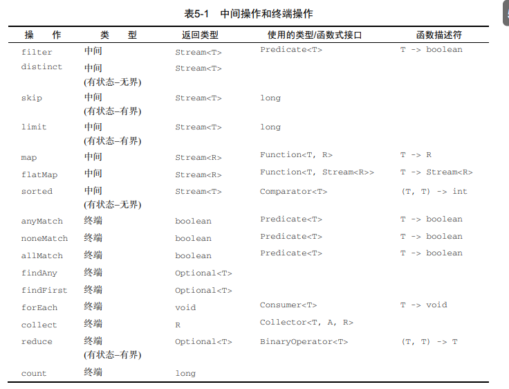

# Java8

`java.util.function`中所设计的函数式接口

```java
@FunctionalInterface
public interface Predicate<T> {
    boolean test(T t);
}

@FunctionalInterface
public interface Consumer<T> {
    void accept(T t);
}

@FunctionalInterface
public interface Function<T, R> {
    R apply(T t);
}

 public static void main(String[] args) throws IOException {
        String oneLine = processFile((BufferedReader br)->br.readLine()+br.readLine());


        List<Integer> l = map(Arrays.asList("lambdas","in","action"),
                (String s)->s.length());

    }


    public static <T,R> List<R> map(List<T> list, Function<T,R> f){

        List<R> result = new ArrayList<>();
        for (T t : list) {
            //这里是某个行为，可以将每个key的字符长度统计出来
            result.add(f.apply(t));
        }
        return result;
    }
```


#### 流简介


需要说明的是，流只能被消费一次。如果你想要再次消费，只能重新获取流

```java
ist<String> title = Arrays.asList("java8","in","action");
        Stream<String> s = title.stream();
        s.forEach(System.out::println);
        s.forEach(System.out::println);//会打印错误
```


终端操作是一个不会返回stream类型的操作，返回的可能是Integer，也可能是void


#### 使用流

#### Optional




#### 收集器例子的整体回顾


### 自定义流的使用流程


Collector接口中combiner方法的存在意义

原文的意思是指，因为我们使用流的一个比较大的优势是在可以默认帮我们优化收集的性能，提高性能比较简单的方法就是并行，stream会将一个完整的流拆分成若干的子流进行处理，最后通过combiner进行合并，也就是这里的含义。

当然拆分成子流并不是无限制拆分，直到定义流是否要进一步拆分的一个条件为非，就不会再次拆分了。


