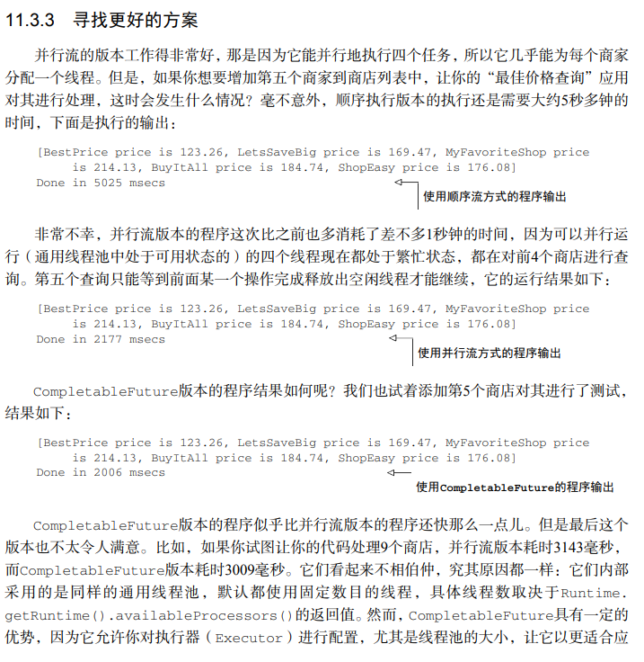
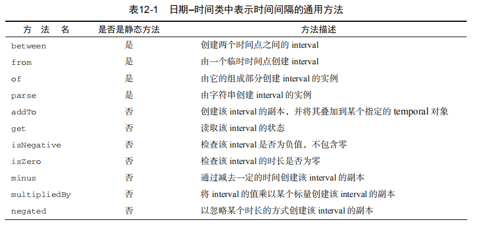

# Java8

`java.util.function`中所设计的函数式接口

```java
@FunctionalInterface
public interface Predicate<T> {
    boolean test(T t);
}

@FunctionalInterface
public interface Consumer<T> {
    void accept(T t);
}

@FunctionalInterface
public interface Function<T, R> {
    R apply(T t);
}

 public static void main(String[] args) throws IOException {
        String oneLine = processFile((BufferedReader br)->br.readLine()+br.readLine());


        List<Integer> l = map(Arrays.asList("lambdas","in","action"),
                (String s)->s.length());

    }


    public static <T,R> List<R> map(List<T> list, Function<T,R> f){

        List<R> result = new ArrayList<>();
        for (T t : list) {
            //这里是某个行为，可以将每个key的字符长度统计出来
            result.add(f.apply(t));
        }
        return result;
    }
```


#### 流简介


需要说明的是，流只能被消费一次。如果你想要再次消费，只能重新获取流

```java
ist<String> title = Arrays.asList("java8","in","action");
        Stream<String> s = title.stream();
        s.forEach(System.out::println);
        s.forEach(System.out::println);//会打印错误
```


终端操作是一个不会返回stream类型的操作，返回的可能是Integer，也可能是void


#### 使用流

#### Optional


#### 收集器例子的整体回顾


### 自定义流的使用流程


Collector接口中combiner方法的存在意义

原文的意思是指，因为我们使用流的一个比较大的优势是在可以默认帮我们优化收集的性能，提高性能比较简单的方法就是并行，stream会将一个完整的流拆分成若干的子流进行处理，最后通过combiner进行合并，也就是这里的含义。

当然拆分成子流并不是无限制拆分，直到定义流是否要进一步拆分的一个条件为非，就不会再次拆分了。


#### 并行流

请注意，在现实中，对顺序流调用parallel方法并不意味着流本身有任何实际的变化。它 

在内部实际上就是设了一个boolean标志，表示你想让调用parallel之后进行的所有操作都并 

行执行。类似地，你只需要对并行流调用sequential方法就可以把它变成顺序流。请注意，你 

可能以为把这两个方法结合起来，就可以更细化地控制在遍历流时哪些操作要并行执行，哪些要 

顺序执行。例如，你可以这样做： 

```java
stream.parallel().filter(...).sequential().map(...).parallel() .reduce();  
```

但最后一次parallel或sequential调用会影响整个流水线。在本例中，流水线会并行执 

行，因为最后调用的是它。

**配置并行流使用的线程池** 

看看流的parallel方法，你可能会想，并行流用的线程是从哪儿来的？有多少个？怎么 

自定义这个过程呢？

并行流内部使用了默认的ForkJoinPool（7.2节会进一步讲到分支/合并框架），它默认的 

线程数量就是你的处理器数量，这个值是由 Runtime.getRuntime().available

Processors()得到的。 

但是你可以通过系统属性 java.util.concurrent.ForkJoinPool.common.  

parallelism来改变线程池大小，如下所示： 

System.setProperty("java.util.concurrent.ForkJoinPool.common.parallelism","12");  

这是一个全局设置，因此它将影响代码中所有的并行流。反过来说，目前还无法专为某个 

并行流指定这个值。一般而言，让ForkJoinPool的大小等于处理器数量是个不错的默认值， 

除非你有很好的理由，否则我们强烈建议你不要修改它。

#### 使用分支/合并框架的最佳做法


#### 修改代码可阅读性


#### 位于第九章的默认方法


默认方法的引入主要是为了兼容


### 当拥有相同方法前面的default方法的借口被实现的时候，子类调用会使用哪一个方法


#### Optional 的意义


Optional 的 简单 api


分类概括


#### 基础类型的Optional对象，以及为什么应该避免使用它们

不知道你注意到了没有，与 Stream对象一样，Optional也提供了类似的基础类
型——OptionalInt、OptionalLong以及OptionalDouble——所以代码清单10-6中的方法可
以不返回Optional，而是直接返回一个OptionalInt类型的对象。第5章中，我们
讨论过使用基础类型Stream的场景，尤其是如果Stream对象包含了大量元素，出于性能的考量，
使用基础类型是不错的选择，但对Optional对象而言，这个理由就不成立了，因为Optional
对象最多只包含一个值。
我们不推荐大家使用基础类型的Optional，因为基础类型的Optional不支持map、

flatMap以及filter方法，而这些却是Optional类最有用的方法（正如我们在10.2节所看到的
那样）。此外，与Stream一样，Optional对象无法由基础类型的Optional组合构成，所以，举
例而言，如果代码清单10-6中返回的是OptionalInt类型的对象，你就不能将其作为方法引用传
递给另一个Optional对象的flatMap方法。


### Future


#### 快速查询的流程简介


#### 寻找更好的方案




#### 将两个不相干的CompletableFuture合并


### 更加丰富的时间工具




这一部分，请查看`chapter12_bak`包下的内容


#### 函数式编程的说明

在java8以前，我们使用面向对象的思想去编写程序，所以大部分情况下，我们考虑的最多的是**如何做**，而对于java8中的函数编程来说，更多的操作被封装，所以如何去实现也就变成了**要做什么**，例如Stream中的max与filter只需要选择对应的方法，底层将由stream帮我们完成，这样的代码看起简洁明了。

之前的面向对象的思想去编写逻辑时，往往按照计算机的逻辑，去编码，这是我们所谓的**命令式编程**。

很显然，函数式编程的有特点

* 无副作用

  * 不会改变外面或者内部的数据结构
  * 不会抛出异常
  * 无论你这个方法调用多少次，结果都不会改变

* 引用透明性

  * 没有感知的副作用（不改变对调用者可见的变量、不进行I/O、不抛出异常）


### 高阶函数与一等函数

第13章中我们使用术语“函数式编程”意指函数或者方法的行为应该像“数学函数”一样——
没有任何副作用。对于使用函数式语言的程序员而言，这个术语的范畴更加宽泛，它还意味着函
数可以像任何其他值一样随意使用：可以作为参数传递，可以作为返回值，还能存储在数据结构
中。能够像普通变量一样使用的函数称为一等函数（first-class function）。这是Java 8补充的全新
内容：通过::操作符，你可以创建一个方法引用，像使用函数值一样使用方法，也能使用Lambda
表达式（比如，(int x) -> x + 1）直接表示方法的值。Java 8中使用下面这样的方法引用将
一个方法引用保存到一个变量是合理合法的：
Function strToInt = Integer::parseInt;


函数式编程的世界里，如果函数，比如Comparator.comparing，能满足下面任一要求就
可以被称为高阶函数（higher-order function）：

* 接受至少一个函数作为参数
*  返回的结果是一个函数

```
副作用和高阶函数
第7章中我们了解到传递给流操作的函数应该是无副作用的，否则会发生各种各样的问题
（比如错误的结果，有时由于竞争条件甚至会产生我们无法预期的结果）。这一原则在你使用高
阶函数时也同样适用。编写高阶函数或者方法时，你无法预知会接收什么样的参数——一旦传
入的参数有某些副作用，我们将会一筹莫展！如果作为参数传入的函数可能对你程序的状态产
生某些无法预期的改变，一旦发生问题，你将很难理解程序中发生了什么；它们甚至会用某种
难于调试的方式调用你的代码。因此，将所有你愿意接收的作为参数的函数可能带来的副作用
以文档的方式记录下来是一个不错的设计原则，最理想的情况下你接收的函数参数应该没有任
何副作用！
现在我们转向讨论科里化：它是一种可以帮助你模块化函数、提高代码重用性的技术。
```

```
科里化的理论定义
科里化①是一种将具备2个参数（比如，x和y）的函数f转化为使用一个参数的函数g，并
且这个函数的返回值也是一个函数，它会作为新函数的一个参数。后者的返回值和初始函数的
返回值相同，即f(x,y) = (g(x))(y)。
当然，我们可以由此推出：你可以将一个使用了6个参数的函数科里化成一个接受第2、4、
6号参数，并返回一个接受5号参数的函数，这个函数又返回一个接受剩下的第1号和第3号参数
的函数。
一个函数使用所有参数仅有部分被传递时，通常我们说这个函数是部分应用的（partially
applied）。
```

持久化数据结构

```
这一节中，我们会探讨函数式编程中如何使用数据结构。这一主题有各种名称，比如函数式
数据结构、不可变数据结构，不过最常见的可能还要算持久化数据结构（不幸的是，这一术语和
数据库中的持久化概念有一定的冲突，数据库中它代表的是“生命周期比程序的执行周期更长的
数据”）。
我们应该注意的第一件事是，函数式方法不允许修改任何全局数据结构或者任何作为参数
传入的参数。为什么呢？因为一旦对这些数据进行修改，两次相同的调用就很可能产生不同的
结构——这违背了引用透明性原则，我们也就无法将方法简单地看作由参数到结果的映射。
```


#### Stream 的延迟计算

```java
public static Stream<Integer> primes(int n) {
 return Stream.iterate(2, i -> i + 1)
 .filter(MyMathUtils::isPrime)
 .limit(n);
}
public static boolean isPrime(int candidate) {
 int candidateRoot = (int) Math.sqrt((double) candidate);
 return IntStream.rangeClosed(2, candidateRoot)
 .noneMatch(i -> candidate % i == 0);
} 
```

这是之前计算的质数的例子，首先开根号是一种优化，首先指数只能被自己和1整除，那么开根号出来的数相当于将这个数的范围折半，只要在这个方位找到了可以被整除的数也就代表这个数就不是指数了

```
不过这一方案看起来有些笨拙：你每次都需要遍历每个数字，查看它能否被候选数字整除（实
际上，你只需要测试那些已经被判定为质数的数字）。
理想情况下，Stream应该实时地筛选掉那些能被质数整除的数字。这听起来有些异想天开，
不过我们一起看看怎样才能达到这样的效果。
(1) 你需要一个由数字构成的Stream，你会在其中选择质数。
(2) 你会从该Stream中取出第一个数字（即Stream的首元素），它是一个质数（初始时，这个
值是2）。
(3) 紧接着你会从Stream的尾部开始，筛选掉所有能被该数字整除的元素。
(4) 最后剩下的结果就是新的Stream，你会继续用它进行质数的查找。本质上，你还会回到
第一步，继续进行后续的操作，所以这个算法是递归的。
注意，这个算法不是很好，原因是多方面的①。不过，就说明如何使用Stream展开工作这个
目的而言，它还是非常合适的，因为算法简单，容易说明。让我们试着用Stream API对这个算法
进行实现。
```

#### 如果以并发的方式在同一个流上执行多种操作。

位于 附录C，不幸的是，这些特性目前还没有在Java 8的流实现中提供。不过，本附录会为你展示一种方
法，利用一个通用API①，即Spliterator，尤其是它的延迟绑定能力，结合BlockingQueues
和Futures来实现这一大有裨益的特性。