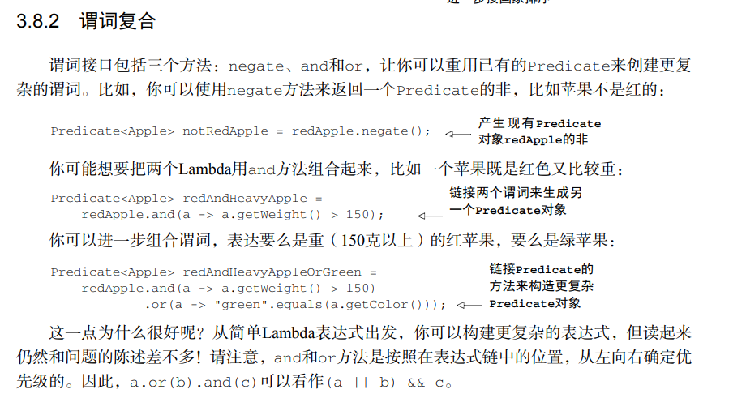

# Java8

`java.util.function`中所设计的函数式接口

```java
@FunctionalInterface
public interface Predicate<T> {
    boolean test(T t);
}

@FunctionalInterface
public interface Consumer<T> {
    void accept(T t);
}

@FunctionalInterface
public interface Function<T, R> {
    R apply(T t);
}

 public static void main(String[] args) throws IOException {
        String oneLine = processFile((BufferedReader br)->br.readLine()+br.readLine());


        List<Integer> l = map(Arrays.asList("lambdas","in","action"),
                (String s)->s.length());

    }


    public static <T,R> List<R> map(List<T> list, Function<T,R> f){

        List<R> result = new ArrayList<>();
        for (T t : list) {
            //这里是某个行为，可以将每个key的字符长度统计出来
            result.add(f.apply(t));
        }
        return result;
    }
```





#### 流简介


需要说明的是，流只能被消费一次。如果你想要再次消费，只能重新获取流

```java
ist<String> title = Arrays.asList("java8","in","action");
        Stream<String> s = title.stream();
        s.forEach(System.out::println);
        s.forEach(System.out::println);//会打印错误
```


终端操作是一个不会返回stream类型的操作，返回的可能是Integer，也可能是void


#### 使用流

#### Optional


